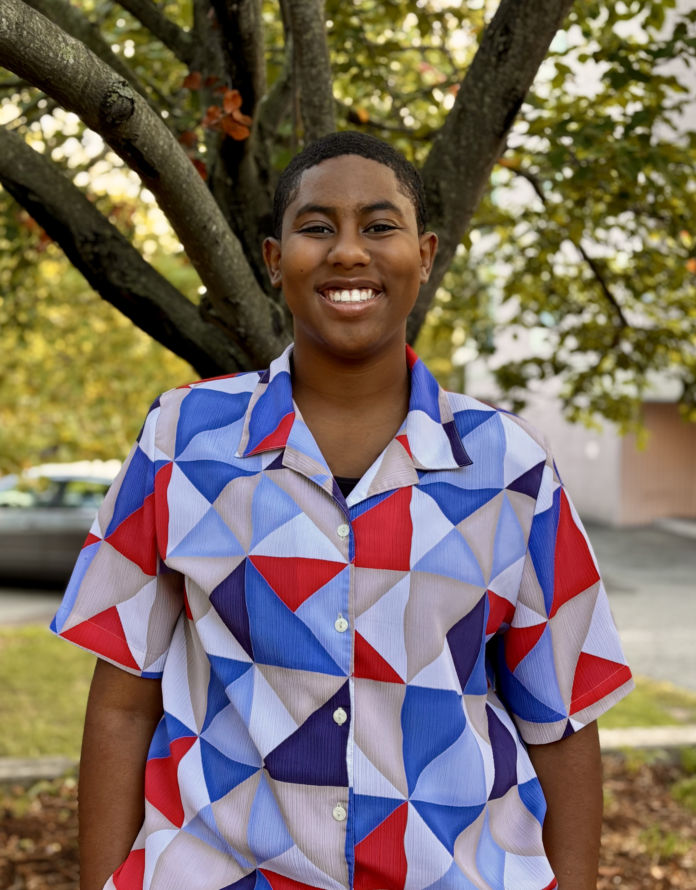

::: {.project-card}

:::: {layout="[7.5,4.5]"}

::::: {#text}

## Learner. Doer. Worldbuilder.

Examining how narrative and structure shape our social world. I use data analysis, research, and writing to contribute to the development of resilient, regenerative communities.

[View Collection](projects/university-major.qmd){.btn}

:::::

::::: {#image .project-img-wrapper} 

[{.project-img}](resume.qmd)

:::::

::::

:::

## Hero Section

# 
I am a learner, doer, and worldbuilder. Currently exploring data, research, and the ethics of technology.

[View My Projects](projects.html){.btn .btn-primary} &nbsp; [Read My Writing](https://breyonnajordan.substack.com/){.btn .btn-outline-secondary}

---

## About Me

I am a college senior navigating the intersection of data science, political ethics, and creative writing. My work is driven by curiosity and a desire to build systems that are both functional and fair.

- **Data & Research:** Analyzing social trends and experimental outcomes.
- **Writing:** Exploring political theory and personal growth on Substack.
- **Values:** Transparency, anti-colonialism, and community-driven tech.

---

## Selected Works

::: {.columns}
::: {.column width="50%"}
### University Major Project
**Change Talk Experiment**  
A study on linguistic patterns in decision-making processes.

[View Details](projects/university-major/change-talk-experiment.html)
:::
::: {.column width="50%"}
### Social Action Op-Ed
**Perspectives on Activism**  
Reflections on digital organizing and real-world impact.

[Read More](projects/social-action-oped.html) <!-- Adjust link as needed -->
:::
:::

---

## Get In Touch

I am always open to connecting with fellow researchers, writers, and technologists.

- **Email:** [your.email@example.com](mailto:your.email@example.com)
- **LinkedIn:** [linkedin.com/in/breyonnajordan](https://linkedin.com/in/breyonnajordan)
- **Substack:** [breyonnajordan.substack.com](https://breyonnajordan.substack.com/)
